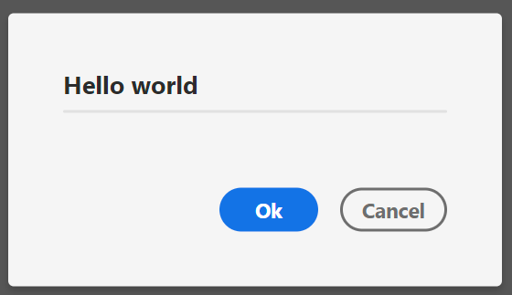
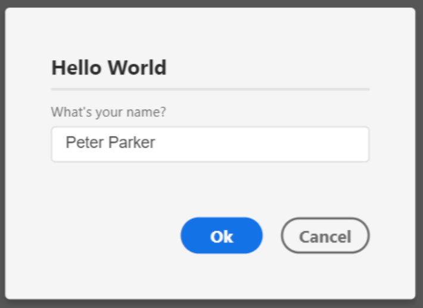

## Prerequisites
We already have completed the steps in the [installation section](installation.md). We should already have the dialog helper imported as `DialogHelper` and our `main.js` file looking somewhat like this:

```js
const DialogHelper = require('xd-dialog-helper'); // or: './lib/dialog-helper' for non-npm plugins

async function myCommand(selection) {
    // [1] Your code goes here
}

module.exports = {
    commands: {
        myCommand
    }
};
```

> **Please note:** As showing a dialog is an asynchronous operation, the command function must be asynchronous as well, thus the `async` keyword.

All code examples shown in this tutorial will get put into the command function *[1]*.

## `DialogHelper.showDialog()` – The central function of the library
The main function of `xd-dialog-helper` is `showDialog()`. With it, you can configure and display your dialogs.

For the most simple dialog (with no contents), this function takes two arguments:

1. A dialog id (`string`), which determines the dialog's HTML id (and gets used to identify the dialog). This must be unique inside your project, although you can display the same dialog multiple times. In that case, however, it should really be the same dialog with the same contents...
2. The dialog's title. This gets displayed in the dialog's header and will be visible for the user.

Let's put this into action and display such a dialog. Let's append our code to look like this:

```js
// [1] Your code goes here
await DialogHelper.showDialog(
	'my-dialog', 
	'Hello world'
);
```

If we now run the plugin, a dialog should open and look something like this:



The `showDialog()` function actually returns a Promise that resolves with an object containing the dialog values when the user clicks the ok button (_Ok_) or rejects when the user
cancels the dialog by either clicking _Cancel_ or pressing _ESC_ on their keyboard.

To cover these cases, we'll surround calling the function with a try-catch-block (which goes into catch when the user cancels the dialog) and store the results returned from the dialog
in a new variable called `results`:

```js
// [1] Your code goes here
try {
	const results = await DialogHelper.showDialog(
		'my-dialog', 
		'Hello world'
	);
	console.log(JSON.stringify(results));
} catch (e) {
	console.log('The user has cancelled the dialog.');
}
```

If we now run our plugin again and click _Ok_, `{}` will get printed in the console. This, of course, makes sense, since the dialog still has no contents, and thus, no values.

Let's look at how to add contents to the dialog:

## Adding contents to the dialog
Contents of the dialog can get passed in the third argument passed into `showDialog()`, `contents`. This is an array (which is empty by default) of [`ContentElementDeclaration`s](reference--ContentElementDeclaration) which determine the properties (props) of dialog elements.

A `ContentElementDeclaration` is – first and foremost – an object containing type and props of the `ContentElement`. You can find a full list of the supported and required props of each `ContentElementType` in its specific type page in the _Types_ section of the reference.

There are two properties every element needs: It's `type` (a `ContentElementType`) and its id (a `string` denoting the id of the element – must be unique inside the dialog).

By default, `xd-dialog-helper` comes with eight types which can be found in the `DialogHelper.types` namespace:

* `CHECKBOX` – a checkbox. Find out more in the [type's documentation](reference--types-checkbox) 
* `HEADER` – a section headline. Find out more in the [type's documentation](reference--types-header) 
* `HR` – a horizontal rule (`<hr>`) element. Find out more in the [type's documentation](reference--types-hr) 
* `SELECT` – a select/dropdown element. Find out more in the [type's documentation](reference--types-select) 
* `SLIDER` – a numeric slider element. Find out more in the [type's documentation](reference--types-slider) 
* `TEXT` – a static text element. Find out more in the [type's documentation](reference--types-text) 
* `TEXT_AREA` – a dynamic text area input element. Find out more in the [type's documentation](reference--types-text_area) 
* `TEXT_INPUT` – a dynamic text input element. Find out more in the [type's documentation](reference--types-text_input) 

Let's add a simple input element asking the user for his/her name. For this, we're going to use `DialogHelper.types.TEXT_INPUT`. By looking at its [documentation page](reference--types-text_input). There, we can see that (among some other, optional types), this – in addition to an id (let's choose `'name'` here) and its type (`DialogHelper.types.TEXT_INPUT`), this
also requires a `label` prop. Let's use `'What\'s your name?'` as label in this case. We could also pass an initial value as `value` or make the input field `required`, but let's not
focus on that and instead just create our text field for now.

To do that, we adjust our code too look like this:
```js
// [1] Your code goes here
try {
	const results = await DialogHelper.showDialog(
		'my-dialog', 
		'Hello world',
		[
			{
				id: 'name',
				type: DialogHelper.types.TEXT_INPUT,
				label: 'What\'s your name?'
			},
		]
	);
	console.log(JSON.stringify(results));
} catch (e) {
	console.log('The user has cancelled the dialog.');
}
```

If we now run our dialog again, it's going to look like this:



When we now enter a name (_Peter Parker_) in this case, click _Ok_ and look at the console output, we can see that it looks something like this:

```json
{ "name": "Peter Parker" }
```

Let's conclude this example by actually greeting our user in the console, instead of just printing the JSON string of the results. To do this, replace `console.log(JSON.stringify(results));`
with

```js
console.log('Hello, ' + results['name']);
```
If we take one last look at the console, after running our plugin again, we get to see a nice greeting:

```
Hello, Peter Parker
```
