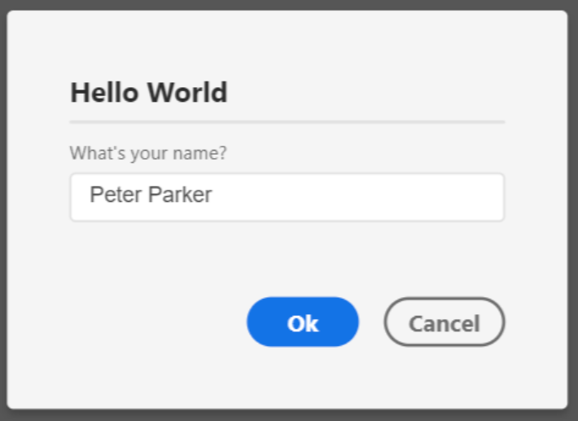

## Screenshot


## Description
A very bare-bones, "Hello World"-like dialog asking the user for his/her name, as seen in the [first dialog section](first-dialog).

## Code
```js
const DialogHelper = require('xd-dialog-helper');

async function dialog() {
	try {
		const results = await DialogHelper.showDialog(
			'my-dialog', 
			'Hello world',
			[
				{
					id: 'name',
					type: DialogHelper.types.TEXT_INPUT,
					label: 'What\'s your name?'
				},
			]
		);
		console.log('Hello, ' + results['name']);
	} catch (e) {
		console.log('The user has cancelled the dialog.');
	}
}
```
