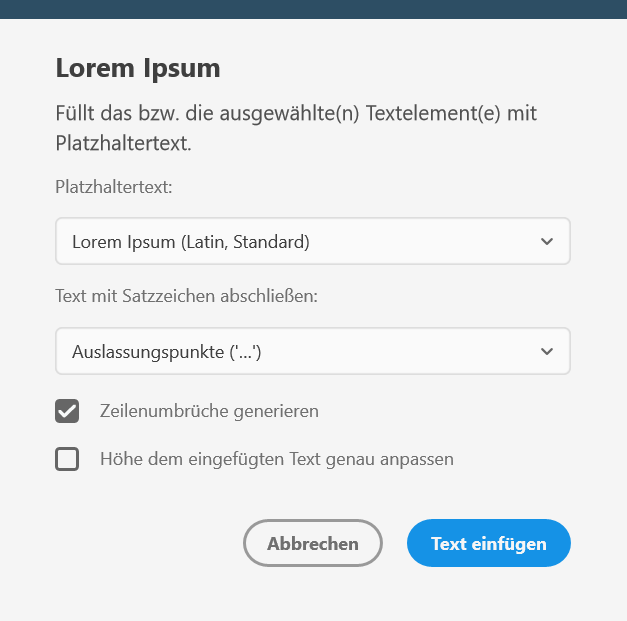

## Screenshot


## Description
> **Disclaimer:** As I am the developer of both the plugin [Lorem Ipsum](https://xdplugins.pabloklaschka.de/plugins/lorem-ipsum) and `xd-dialog-helper`, I want to mention the fact
> that I'm the plugin's developer here for full disclosure. As the plugin is free, however, and uses the library, I think it's a great example of how the library actually got used.

The main dialog of the "real" _Lorem Ipsum_ plugin for Adobe XD CC by Pablo Klaschka ([website](https://xdplugins.pabloklaschka.de/plugins/lorem-ipsum). Among other things, it
* has full localization, thanks to the [`xd-localization-helper`](https://github.com/pklaschka/xd-localization-helper) library
* "remembers" user input via the [`xd-storage-helper`](https://github.com/pklaschka/xd-storage-helper)
* Automatically sets focus to the Ok button so that a user can simply press the _Return_-key after opening the dialog to confirm the settings (which are the same as when the plugin got used previously)
* adds a corporate-colored bar at the top

## Code
Please note that the plugin is also using [`xd-storage-helper`](https://github.com/pklaschka/xd-storage-helper) and [`xd-localization-helper`](https://github.com/pklaschka/xd-localization-helper) – two other MIT-licensed Open-Source libraries for XD plugin development, which is why, e.g.,
labels have `lang.get(key)` constructs instead of strings (the function simply returns the localized version of the string with the specified `key`.

```js
/*
 * Copyright (c) 2019. by Pablo Klaschka
 */

const storage = require('xd-storage-helper');
const lang = require('xd-localization-helper');
const dialogHelper = require('xd-dialog-helper');


/**
 * @throws {Error} error when dialog gets canceled
 */
async function modalAsync() {
    const uiOptions = await storage.get('loremOptions', {
        text: 'lorem-lat',
        terminationString: 'n/a',
        includeLineBreaks: true,
        trim: false
    });

    try {
        const loremOptions = await dialogHelper.showDialog('lorem-main', 'Lorem Ipsum',
            [
                {
                    id: 'description',
                    type: dialogHelper.types.TEXT,
                    label: lang.get('modal-lorem-description')
                },
                {
                    type: dialogHelper.types.SELECT,
                    options: [
                        {value: 'lorem-lat', label: 'Lorem Ipsum (Latin, Standard)'},
                        {value: 'cicero-lat', label: 'Cicero (Latin)'},
                        {value: 'cicero-en', label: 'Cicero (English)'},
                        {value: 'pangram-en', label: 'Pangram (English)'},
                        {value: 'pangram-de', label: 'Pangram (German)'},
                        {value: 'pangram-es', label: 'Pangram (Espagnol)'},
                        {value: 'pangram-fr', label: 'Pangram (Français)'}
                    ],
                    id: 'text',
                    label: lang.get('modal-lorem-text-label'),
                    value: uiOptions.text
                },
                {
                    type: dialogHelper.types.SELECT,
                    id: 'terminationString',
                    label: lang.get('modal-lorem-terminate-label'),
                    options: [
                        {value: 'n/a', label: lang.get('modal-lorem-terminate-none')},
                        {value: '.', label: lang.get('modal-lorem-terminate-period')},
                        {value: '…', label: lang.get('modal-lorem-terminate-ellipsis')},
                    ],
                    value: uiOptions.terminationString
                },
                {
                    type: dialogHelper.types.CHECKBOX,
                    id: 'includeLineBreaks',
                    label: lang.get('modal-lorem-includeLineBreaks-label'),
                    value: uiOptions.includeLineBreaks
                },
                {
                    type: dialogHelper.types.CHECKBOX,
                    id: 'trim',
                    label: lang.get('modal-lorem-trim-label'),
                    value: uiOptions.trim
                }
            ],
            {
                okButtonText: lang.get('modal-lorem-btn-ok'),
                cancelButtonText:
                    lang.get('modal-lorem-btn-cancel'),
                width:
                    400,
                css: `
                header {
                    background: #2D4E64;
                    height: 16px;
                    position: absolute;
                    left: 0;
                    top: 0;
                    right: 0;
                }
                input[type="checkbox"] {
                    width: 18px;
                }`,
                onBeforeShow:
                    htmlDialogElement => {
                        htmlDialogElement.appendChild(document.createElement('header'));
                        document.getElementById('lorem-main-dialogHelperBtnOk')
													.setAttribute('autofocus', 'autofocus');
                    }
            });
        await storage.set('loremOptions', loremOptions);
        return loremOptions;
    } catch (e) {
        throw new Error('User canceled dialog');
    }
}

module.exports = showModal;
```
