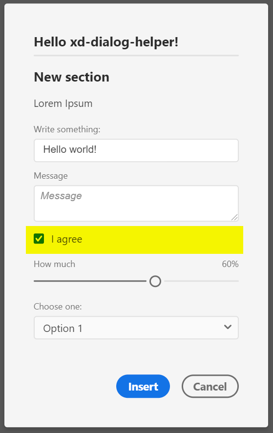

## Signature
`readonly DialogHelper.types.CHECKBOX: ContentElementType`

## Type
[`ContentElementType`](reference--ContentElementType.html) exported readonly member of the `require('xd-dialog-helper').types` namespace

## Description
A checkbox element

## Properties in element declaration
### Required properties
- `id: string`
- `label: string`

 ### Supported props
 - `value: boolean` – Initial value (default: `false`)
 - `htmlAttributes: object` – get applied to the `<input type="checkbox">` element
 - `required: boolean` – determines if checkbox  is invalid when it's not checked (default: `false`)