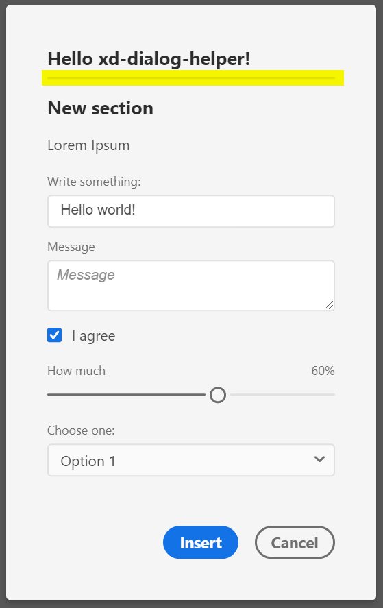

## Signature
`readonly DialogHelper.types.HR: ContentElementType`

## Type
[`ContentElementType`](reference--ContentElementType.html) exported readonly member of the `require('xd-dialog-helper').types` namespace

## Description
A horizontal rule (`
`) element

## Properties in element declaration
### Required properties
- `id: string`

 ### Supported props
 - `htmlAttributes: object` – get applied to the `
` element