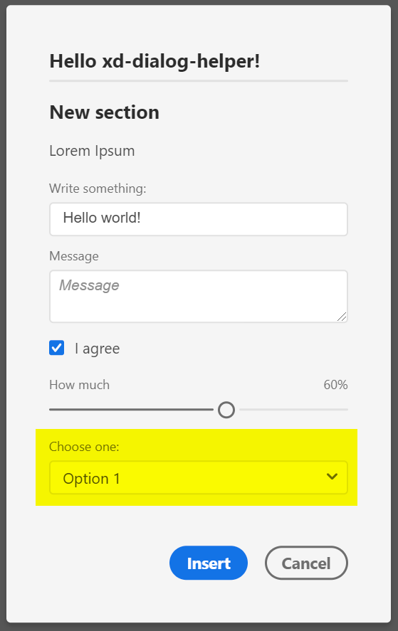

## Signature
`readonly DialogHelper.types.SELECT: ContentElementType`

## Type
[`ContentElementType`](reference--ContentElementType.html) exported readonly member of the `require('xd-dialog-helper').types` namespace

## Description
A selection/dropdown element

## Properties in element declaration
### Required properties
- `id: string`
- `label: string`
- `options: Array<{value: string, label: string}>` – The options of the dropdown
### Supported properties
- `value: string` – Initial value (value of the initially selected option in `options`), must match a `value` in one of the `options`
- `htmlAttributes: object` – get applied to the `<select>` element