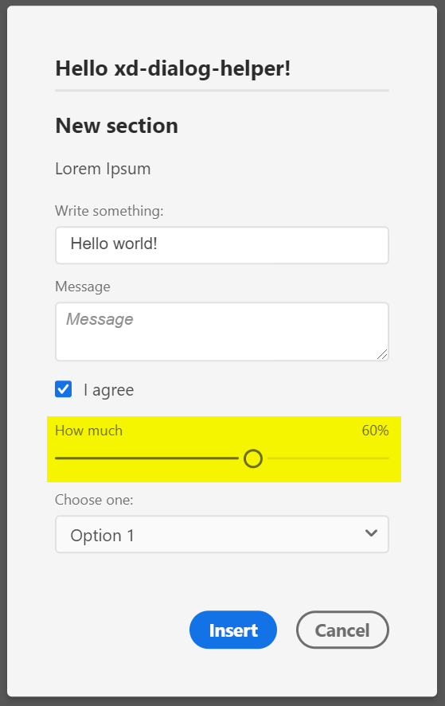

## Signature
`readonly DialogHelper.types.SLIDER: ContentElementType`

## Type
[`ContentElementType`](reference--ContentElementType.html) exported readonly member of the `require('xd-dialog-helper').types` namespace

## Description
A numeric value slider element

## Properties in element declaration
 ### Required properties
 - `id: string`
 - `label: string`
 - `value: number` – Initial value of the slider
 - `htmlAttributes: object` – get applied to the `<input type="range">` element
 - `htmlAttributes.min: number` – minimum slider value
 - `htmlAttributes.max: number` – maximum slider value

 ### Supported properties
 - `unit: string` – Unit of the slider – gets displayed on the right-hand side above the slider