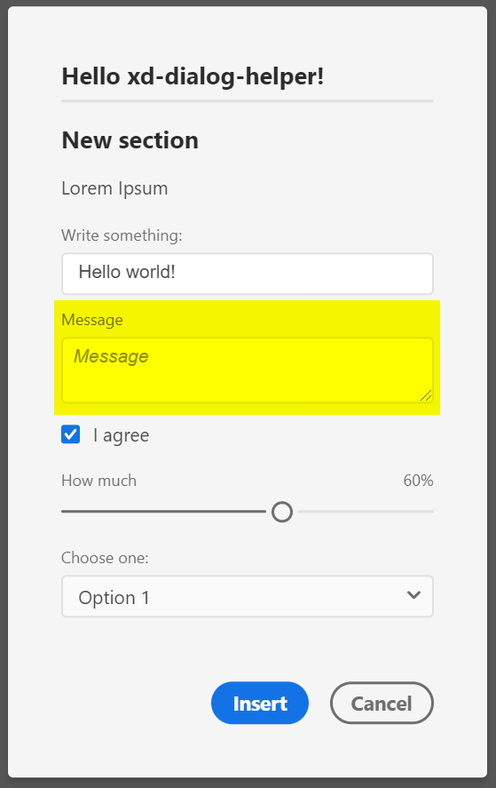

## Signature
`readonly DialogHelper.types.TEXT_AREA: ContentElementType`

## Type
[`ContentElementType`](reference--ContentElementType.html) exported readonly member of the `require('xd-dialog-helper').types` namespace

## Description
A text area input element

## Properties in element declaration
### Required properties
- `id: string`
- `label: string`

 ### Supported props
 - `value: boolean` – Initial value (default: `''`)
 - `htmlAttributes: object` – get applied to the `<textarea>` element
 - `required: boolean` – determines if the element requires text (i.e., the field must not be empty) to be valid (default: `false`)