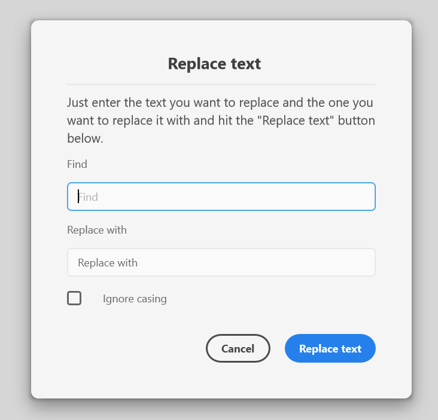

## Screenshot


## Description
A dialog to find and replace text. It includes a simple explanation text, text inputs for the searched and replace texts, a checkbox to "ask" whether finding the text is case-sensitive and the Ok- and Cancel-buttons (where we labelthe Ok-button with "Replace text").

## Code
```js
const DialogHelper = require('xd-dialog-helper');

function myFunction(selection) {
    DialogHelper.showDialog('replace-text-dialog', 'Replace text', [
        {
            type: DialogHelper.types.HR,
            id: 'myHR'
        },
        {
            type: DialogHelper.types.TEXT,
            id: 'explanation',
            label: 'Enter the text you want to replace and the one you want to ' +
                'replace it with and hit the "Replace text" button below.'
        },
        {
            type: DialogHelper.types.TEXT_INPUT,
            id: 'match',
            label: 'Find'
        },
        {
            type: DialogHelper.types.TEXT_INPUT,
            id: 'replace',
            label: 'Replace with'
        },
        {
            type: DialogHelper.types.CHECKBOX,
            id: 'caseInsensitive',
            label: 'Ignore casing',
            value: false
        }
    ], {
        okButtonText: 'Replace text'
    }).then((results) => {
        // Repalce the text
        results.match // The value of the first text input
        results.replace // The value of the second text input
        results.caseInsensitive // Boolean: Checkbox checked?
    }, (reason) => {
        // Dialog got rejected
        console.log('The dialog got rejected');
    });
}
```