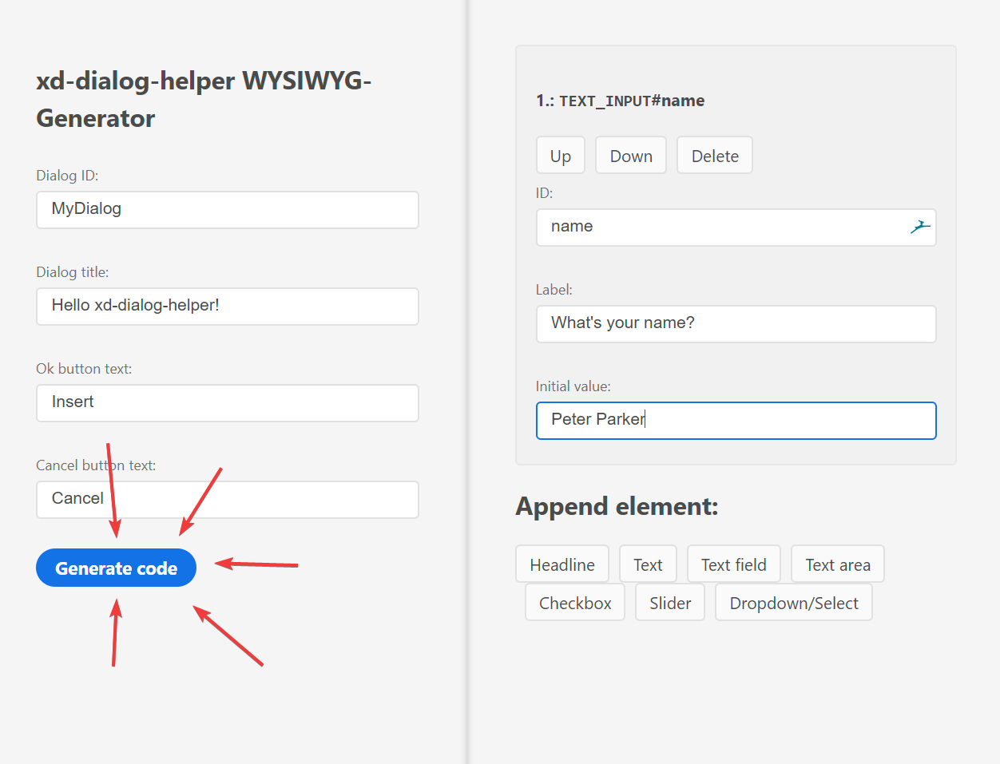

## The website
We can find a WYSIWYG-Editor at <https://xd-dialog-helper.pabloklaschka.de/editor>.


With it, we're able to create dialogs without having to write any code. This allows for quick prototyping and iterating in the creation of modals, and can save valuable time we can use to build more features of our plugin.

As we can see in the screenshot above, the editor consists of three sections. In the left section, we specify general settings for the dialog – its id, button labels and the title. In the second column, we edit the contents of the dialog. On the right, we see a preview of what the dialog will look like in XD.

> **Please note:**
> The preview we see in the editor **might not** be the exact result we'll get in XD and should under no circumstances replace testing the dialog inside XD.

## Editing dialog contents
Let's focus on the middle section and build a dialog.

First, let's delete all existing content elements by clicking the *Delete* button for the *HR* element:


Now, let's recreate our Hello World dialog asking for a user's name by adding a new text field. Create it by clicking on *Text field* und *Append element*. We should now see a new element show up:


Now, to finish the dialog, let's edit id, label and initial value of our input:


We've now finished the dialog and can generate it's code.

## Using the generated code
To generate the code for a dialog, click *Generate code* in the left-hand panel:



When clicking the button, a dialog with the generated code appears. Let's copy this section of code into a new file called `dialog2.js` next to our `main.js` inside the project:


Our `dialog2.js` file should now look like this:

```js
const DialogHelper = require('xd-dialog-helper');
async function showdialog() {
    try {
        const results = await DialogHelper.showDialog("dialog", "Hello World!", [{
            "type": DialogHelper.types.TEXT_INPUT,
            "id": "name",
            "label": "What's your name?",
            "value": "Peter Parker"
        }], {
            okButtonText: "Ok",
            cancelButtonText: "Cancel"
        });
        // Do something with the results here...
    } catch (e) {
        // Dialog got canceled
    }
}
module.exports = showdialog;
```

This should, of course, feel akin to the code we wrote in the previous section for our manual [Hello World dialog](first-dialog.md). Now, let's again add the `console.log(results['name'])` below the comment `// Do something with the results here...`, resulting in the code looking like this:

```js
[...]
const results = await DialogHelper.showDialog([...]);
console.log('Hello, ' + results['name']);
[...]
```

The last thing we'll need to do is to actually call the `showdialog` function now exported from this module by going back to our `main.js` file and replacing its code with:

```js
async function myCommand(selection) {
    const showWysiwygDialog = require('./dialog2')
}

module.exports = {
    commands: {
        myCommand
    }
};
```

Now, if we run the plugin, we'll get the same result when running the plugin as with our manually coded plugin:
1. A dialog asking us for our name opens
2. A console output greeting us with the name we entered in the dialog.

## Conclusion
As you can see, the editor allows us to create dialogs quick. While most of the time, we'll want to adjust the generated code afterwards, we can use the editor to get to the first version of our dialog as fast as possible...